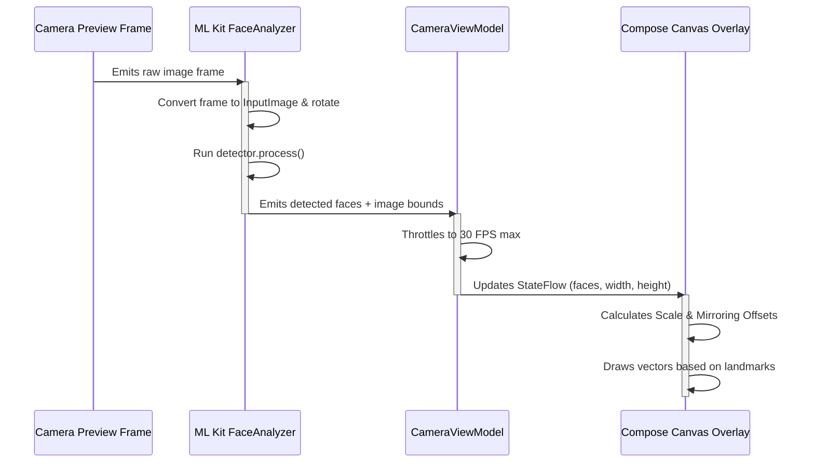

# FaceFit AR (Android)

**FaceFit AR** is a native Android application that applies **real-time facial AR filters** using **Google ML Kit face landmarks** overlaying a **CameraX live preview**. It is built with Jetpack Compose, adheres to the MVVM architecture, and supports email-based signup/login and Google authentication via the Android Credentials Manager API.

---

## 🚀 Key Features

*   **Secure Authentication System:**
    *   Email & Password Login/Registration with real-time input validation (email format verification, matching password validations, minimum length checks).
    *   **Google Sign-In** integration using modern **Jetpack Credential Manager API**.
    *   Automatic background sync that records new user profiles (`uid`, `email`, creation timestamp) to a **Firebase Firestore** collection.
*   **Real-Time AR Filtering Pipeline:**
    *   Continuous frame streaming via **CameraX ImageAnalysis**.
    *   Super-fast facial feature and landmark tracking via **Google ML Kit Vision Face Detection**.
    *   Lightweight, hardware-accelerated Compose `Canvas` rendering layer.
*   **Highly Calibrated AR Filters:**
    *   **Normal:** Clean, unfiltered camera preview.
    *   **Rose Crown:** Crown placed on the forehead scaling automatically relative to eye-to-eye distance.
    *   **Animal Ears:** Cat/bear ears that remain upright and scale with the face.
    *   **Cool Glasses:** Angled and rotated sunglasses matching the face tilt via trigonometric angle calculation.
    *   **Safety Mask:** Surgical mask that anchors across cheeks, nose, and mouth bottom complete with ear straps.
    *   **Sparkles:** Whimsical stars and glowing dots floating around the face bounds.
*   **High-Quality Media Capture:**
    *   Captures high-resolution bitmap frames directly from the preview stream.
    *   Recomputes and draws the active filter onto the image bitmap using native Android `Canvas`.
    *   Saves the resulting JPEG to the gallery folder `Pictures/FaceFitAR` via the **MediaStore API** for compatibility across SDK levels.
*   **Modern Design & Aesthetics:**
    *   Curated themes (Dark Mode and Light Mode support).
    *   Translucent floating overlay panels.
    *   Micro-animations and layout highlights for filter selection.
    *   Visual alerts for states such as "No Face Detected" or "Saving...".

---

## 🛠️ Tech Stack & Dependencies

*   **Language:** Kotlin
*   **UI Framework:** Jetpack Compose (Material 3)
*   **Architecture:** Model-View-ViewModel (MVVM) with StateFlow
*   **Camera Integration:** CameraX (`camera-core`, `camera-lifecycle`, `camera-view`)
*   **Machine Learning/Vision:** Google ML Kit Face Detection (Landmark mode enabled)
*   **Backend Services:**
    *   Firebase Authentication (Email/Password & Google Provider credentials)
    *   Firebase Cloud Firestore
*   **Auth Manager:** Jetpack Credentials Manager (`androidx.credentials`)
*   **Permissions Handling:** Google Accompanist Permissions API
*   **Build System:** Gradle (Kotlin DSL - `.gradle.kts`) with Version Catalogs

---

## 📂 Project Directory Structure

```text
app/src/main/java/com/example/facefitar/
│
├── FaceFitApplication.kt          # Main Application class, ThemeManager initialization
├── MainActivity.kt                # Application Entry Point & theme configuration
│
├── auth/                          # Authentication flow and credentials helper
│   ├── AuthViewModel.kt           # Auth validation logic, Firebase sign-in flows
│   └── GoogleAuthHelper.kt        # Jetpack Credential Manager Google sign-in configuration
│
├── camera/                        # Vision processing & overlay utilities
│   ├── FaceAnalyzer.kt            # ML Kit Analyzer for CameraX image frames
│   ├── FaceOverlayState.kt        # Model class for face coordinate coordinates
│   ├── FilterType.kt              # Enum containing active filters (ROSE_CROWN, etc.)
│   └── ImageCaptureUtils.kt       # Native Canvas drawing math and MediaStore saving logic
│
├── ui/                            # View components
│   ├── navigation/
│   │   └── NavGraph.kt            # Composable router for screens (Login, Signup, Home, Profile)
│   ├── screens/
│   │   ├── auth/
│   │   │   ├── LoginScreen.kt     # Log in page UI
│   │   │   └── SignUpScreen.kt    # Sign up page UI
│   │   ├── camera/
│   │   │   └── CameraPreviewScreen.kt # Live AR Camera View & Compose Canvas overlay
│   │   └── profile/
│   │       └── ProfileScreen.kt   # Profile detail page & theme toggle switches
│   └── theme/
│       ├── Color.kt
│       ├── Theme.kt               # Jetpack Compose Material 3 Theme setup
│       └── Type.kt
```

---

## ⚙️ Setup & Installation

### Prerequisites
*   Android Studio Ladybug (or higher)
*   Android SDK 24 (Minimum SDK) / 36 (Target SDK)
*   A physical Android device (recommended for testing camera/AR features)

### Setup Steps
1.  **Clone the Repository:**
    ```bash
    git clone https://github.com/Sahil07ii/FaceFit_AR.git
    cd FaceFit_AR
    ```
2.  **Add Firebase Configuration:**
    *   Create a project on the [Firebase Console](https://console.firebase.google.com/).
    *   Add an Android App, registering the application ID: `com.example.facefitar`.
    *   Generate your `google-services.json` and download it.
    *   Copy `google-services.json` into the `/app` directory of the project.
3.  **Configure Google Sign-In:**
    *   Get your debug/release SHA-1 certificate fingerprint using the Gradle signing report:
        ```bash
        ./gradlew signingReport
        ```
    *   Add this SHA-1 fingerprint to your Android App settings in the Firebase Console.
    *   Copy the generated **Web Client ID** from the Firebase Console Google Sign-in settings.
    *   Open `GoogleAuthHelper.kt` and paste it under the `WEB_CLIENT_ID` constant:
        ```kotlin
        const val WEB_CLIENT_ID = "YOUR_WEB_CLIENT_ID_HERE"
        ```
4.  **Sync and Run:**
    *   Open the project in Android Studio.
    *   Perform a **Gradle Sync**.
    *   Connect your Android device via USB debugging.
    *   Build and run the project (`Shift + F10`).

---

## 🏗️ Architecture & Pipeline Flow



---

## 📈 Performance Engineering

*   **Analyzer Throttling:** Capped face calculations at **30 FPS** to avoid overloading Jetpack Compose with unnecessary layout changes.
*   **Direct GPU Canvas Overlay:** Renders AR filters on a separate GPU-composited canvas overlay rather than mutating preview buffers, keeping camera frames fluid.
*   **Memory Safety:** Employs the `ImageAnalysis.STRATEGY_KEEP_ONLY_LATEST` CameraX configuration and calls `imageProxy.close()` immediately on completion to ensure frames are cleared from memory.
